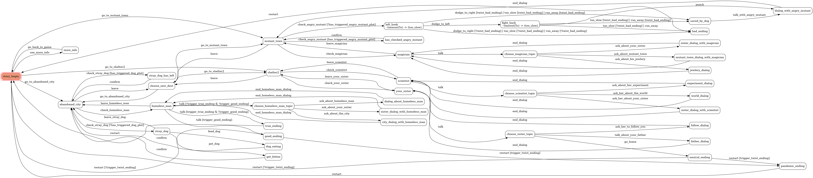

# text-adventure-line-bot
Final project for Theory of Computation, build a Line bot that runs a text adventure game with state machines.

I decided to make a text adventure game since I think it's easy to present complex state machines through its storyline.

And I also enjoy games with multiple plot twists and secret endings, so I made this project in five days(about 24 hours). 
# Tools, Packages
- Django
- Pytransitions Package(python)
- Line Bot SDK
- deploy on [PythonAnywhere](https://www.pythonanywhere.com/)
- Line Developer Console
# Basic Requirements
## FSM
Whole State Diagram

Initial State Diagram

Implemented with pytransitions/transitions package
## Line Bot
- Made With Django and Line Bot SDK
- Deployed on [PythonAnywhere](https://www.pythonanywhere.com)
## Files
### Documentation
- [README.md](README.md)
- [state diagrams in static directory](./text_adventure_line_bot/static/)

---
### Code
- [Story class](./text_adventure_line_bot/line_bot_app/Story/)
- [bot callback on views.py](./text_adventure_line_bot/line_bot_app/views.py)
## How to use
1. Scan QR code with your phone, or search Line ID:@899djtxa 

2. Add the bot as friend
3. The bot will tell you the story and offer you options, you can press buttons on screen or type uppercase letters to act

4. Try to find out all 5 endings, two plot twists, and several CS related easter eggs.
# Functionality
## State(Storyline)
遊戲主線劇情是讓主角你在末日中尋找自己失蹤的妹妹, 你有三個地區可以探索,與多個NPC對話來了解世界觀, 遊戲共有五種結局,多種劇情轉折,同時在某個環節有QTE玩法.

某些劇情(狀態)可以讓玩家進入其他狀態時因為條件不同而有不同結局.

例如,餵食流浪狗會讓你將進入壞結局時被救下,讓故事能繼續.
又或者是與某位NPC談論某個主題後再次與另一位NPC對話可以觸發真結局.又或者是某個事件能導致好結局完全反轉.

遊戲透過許多交錯的劇情讓狀態機的狀態更加豐富, 利用變數和[pytranstions中的conditional transition](https://github.com/pytransitions/transitions#conditional-transitions)讓同一種選擇在不同的情境（先前發生的事）中會有不同的結果.

而遊戲另外使用了[pytransitions中的Timeout功能](https://github.com/pytransitions/transitions#adding-features-to-states)實做了QTE機制,給玩家驚喜的同時增添狀態機的豐富性,在一定時間（五秒）內沒進行transition會自動進入下一個狀態

遊戲同時也使用了變數紀錄狀態的歷史,避免某些關鍵劇情在一場遊戲中被重複觸發.

而每個狀態都因為有自己的故事劇情,所以能避免不必要的狀態存在,每種狀態都能代表不同的意義.
# Bonus - Deploy
將Django專案deploy於[PythonAnywhere](https://www.pythonanywhere.com/) 上,透過上傳程式碼,設定虛擬環境變數並下載模組以讓伺服器運行.

再連接Line Developer的Webhook,讓line bot能使用line bot sdk的reply_message透過回覆訊息的方式完成文字冒險遊戲.